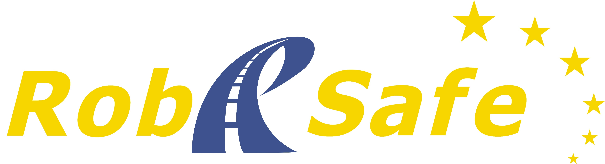
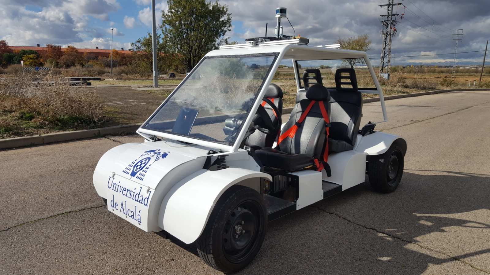

# ROS bev_tracking package

This ROS package allows to connect ["OpenPCDet fork"](https://github.com/JavierEgido/OpenPCDet/) and ["AB3DMOT fork"](https://github.com/JavierEgido/AB3DMOT).

This GitHub provides the exact version used on Master's Final Project written by **Javier del Egido**. The project studies state-of-the-art Detection and Multi-Object Tracking  (DAMOT) proposals in order to desing a funcional pipeline to be embebbed on Nvidia Jetson AGX Xavier mounted on ["Techs4AgeCar vehicle"](http://www.robesafe.uah.es/index.php/es-es/) developed by ["Robesafe research group"](https://github.com/RobeSafe-UAH).

<p align="center">
  
</p>

# Setting

It must be added as a ROS package inside a ROS workspace src folder. If you do need to create from zero:

```
$ mkdir -p ~/catkin_ws/src
$ cd ~/catkin_ws/
$ catkin_make
$ cd src
$ git clone https://github.com/JavierEgido/bevtracking
$ cd ..
$ catkin_make
```

## Contact

This ROS package is maintained by ["Javier del Egido"](https://github.com/JavierEgido) and ["Robesafe research group"](https://github.com/RobeSafe-UAH)
